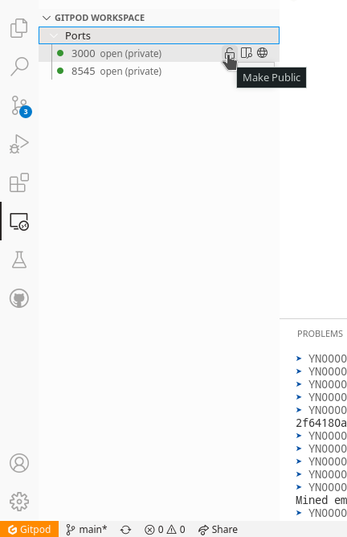

# DEVELOPER_DAO DOMAINS

Implementation for registrars and local resolved for the Developer DAO Naming Service.

## Contents
  - [Prerequisites](#prerequisites)
  - [Contracts](#contracts)
  - [Features](#features)
  - [Run in Gitpod](#run-in-gitpod)
  - [Run Locally](#run-locally)
  - [Build For Production](#build-for-production)
  - [Acknowledgements](#acknowledgements)
  - [License](#license)

## Prerequisites

- [pnpm](https://pnpm.io/)
- [Node.js](https://nodejs.org/en/download/)
- [MetaMask wallet browser extension](https://metamask.io/download.html).

## Contracts

## DevDAONFT.sol
Implementation of the naming service NFT, the contract used to mint an ERC721 token linked to each name. The functionality includes:
- Mapping for each name to token Id
- Minting an ERC721 token linked to each name


## DevDAONameService.sol
Implmentation of naming service transaction, the contract used to check name length and mint ERC721 tokens (by communicating with the DevDAONFT.sol). The functionality includes:
- Checking string length is more than minimum
- Checking string length is less than maximum
- Minting an ERC721 token (by communicating with DevDAONFT.sol) and transferring funds to the treasury address


## DevDAOPriceOracle.sol
Implementation of pricing for the naming service, the contract used by the contract owner to set pricing based on name length. The functionality includes:
- Mapping for each price to name string length
- Setter for pricing of each name string length


## DevDAORegistry.sol
The implementation of the registry, the contract used by the token owner to set metadata that will correspond with each name and the respective token Id. The functinality includes:
- Setter for name to token Id
- Setter for user profile metadata struct
- Setter for address metadata
- Setter for content


## DevDAOResolver.sol
The implementation of the resolver.


## Features

Here's an overview of the included frameworks and tools.

- **Next.js** - Minimalistic framework for server-rendered React applications.
- **Typescript** - Superset of JavaScript which primarily provides optional static typing, classes and interfaces.
- **ESLint** - The pluggable linting utility.
- **Turborepo** - High-performance build system for JavaScript and TypeScript codebases.
- **PNPM** - Fast, disk space efficient package manager.
- **Wagmi** - React Hooks library for Ethereum.
- **Tailwind CSS** - Rapidly build modern websites without ever leaving your HTML.
- **Typechain** - TypeScript bindings for Ethereum smart contracts.
- **Hardhat** - Ethereum development environment for professionals.
- **Hardhat-deploy** - A Hardhat Plugin For Replicable Deployments And Easy Testing.
- **Chai** - A  BDD / TDD assertion library for node and the browser that can be delightfully paired with any javascript testing framework.
- **Mocha** - A feature-rich JavaScript test framework.

## Run in Gitpod
To run this project in Gitpod, follow these steps:
<br/>
1. Click this link to deploy to gitpod
<br/>

[](https://gitpod.io/#github.com/G3root/nextjs-dapp-starter-ts)

2. Import the RPC address given to you by GitPod into your MetaMask wallet

This endpoint will look something like this:

```bash
https://8545-copper-swordtail-j1mvhxv3.ws-eu18.gitpod.io/
```

The chain ID should be 1337. If you have a localhost rpc set up, you may need to overwrite it.
<br/>


You can also change your status of your open ports by going to port settings.
<br/>



## Run Locally

Clone the project

```bash
  npx degit G3root/nextjs-dapp-starter-ts my-project
```

Go to the project directory

```bash
  cd my-project
```

Install dependencies

```bash
  pnpm install
```

Start the development server

```bash
  pnpm dev
```

## Build For Production

To generate production build

```bash
 pnpm build
```
## Acknowledgements

- [template-ethereum-contracts](https://github.com/wighawag/template-ethereum-contracts)

## License

[MIT](https://choosealicense.com/licenses/mit/)
